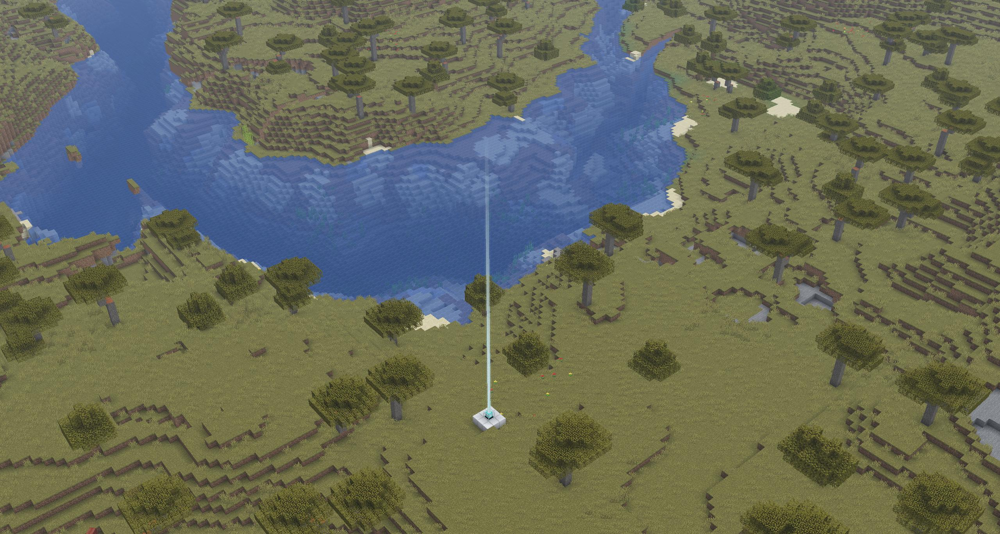

# Unobtrusive Beacons

Simple Fabric mod that makes beacon beams less intrusive by limiting their fully opaque height and smoothly fading them out above that point.

Requires [YetAnotherConfigLib (YACL)](https://modrinth.com/mod/yacl) installed.

Opaque part height and faded part height can be configured from [Mod menu](https://modrinth.com/mod/modmenu).

